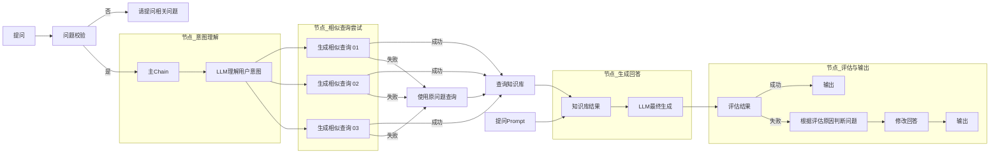
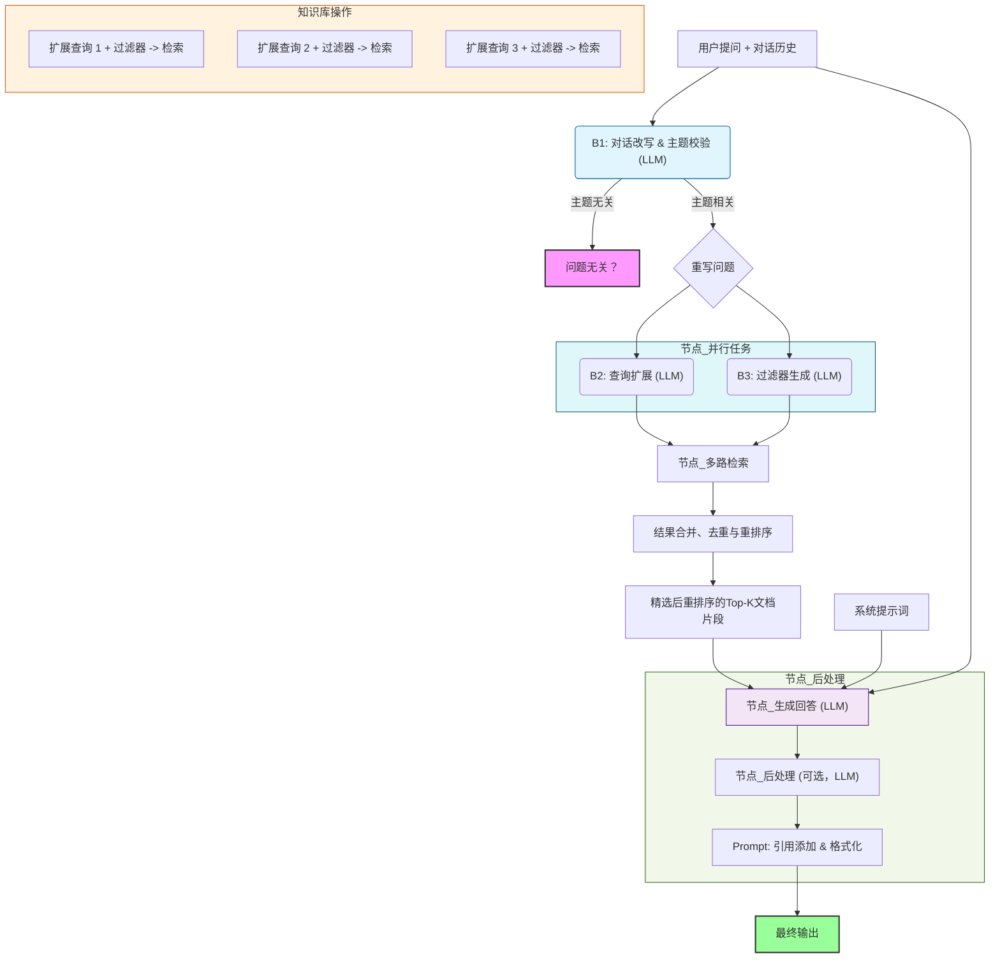

## 待完成

- [x] 节点搭建
- [x] 串联起来
- [x] 单线测试
- [x] 生成效果迭代优化
- [x] 部署
- [x] 总体测试

### 流程图

```mermaid
flowchart LR
    A[提问] --> B[问题校验]
    B -- 否 --> C1[请提问相关问题]
    B -- 是 --> C2[主Chain]

    subgraph 节点_意图理解
        C2 --> D[LLM理解用户意图]
    end

    subgraph 节点_相似查询尝试
        D --> E1[生成相似查询 01]
        D --> E2[生成相似查询 02]
        D --> E3[生成相似查询 03]
    end

    %% 查询逻辑
    E1 -->|成功| F[查询知识库]
    E2 -->|成功| F
    E3 -->|成功| F
    E1 -->|失败| G[使用原问题查询]
    E2 -->|失败| G
    E3 -->|失败| G
    G --> F

    F --> H[知识库结果]
    J[提问Prompt] --> H

    subgraph 节点_生成回答
        H --> K[LLM最终生成]
    end

    subgraph 节点_评估与输出
        K --> M[评估结果]
        M -- 成功 --> L[输出]
        M -- 失败 --> N[根据评估原因判断问题]
        N --> O[修改回答]
        O --> P[输出]
    end

```

修改为：

```mermaid
flowchart TD
    A[用户提问 + 对话历史] --> B1("B1: 对话改写 & 主题校验 (LLM)")

    B1 -- 主题无关 --> C1["问题无关？"]
    
    B1 -- 主题相关 --> C2{"重写问题"}
    
    subgraph 节点_并行任务
        direction TB
        B2("B2: 查询扩展 (LLM)")
        B3("B3: 过滤器生成 (LLM)")
    end

    C2 --> B2
    C2 --> B3
    
    B2 --> D["节点_多路检索"]
    B3 --> D

    subgraph 节点_多路检索 [知识库操作]
        direction TB
        D1["扩展查询 1 + 过滤器 -> 检索"]
        D2["扩展查询 2 + 过滤器 -> 检索"]
        D3["扩展查询 3 + 过滤器 -> 检索"]
        %% ...
    end

    D --> E["结果合并、去重与重排序"]

    E --> F[精选后重排序的Top-K文档片段]
    A --> G["节点_生成回答 (LLM) "]
    F --> G
    J[系统提示词] --> G

    subgraph 节点_后处理
   	    G --> H["节点_后处理 (可选，LLM)"]
        H --> H1[Prompt: 引用添加 & 格式化]
    end

    H1 --> L[最终输出]

    %% Styles
    style C1 fill:#f9f,stroke:#333,stroke-width:2px
    style L fill:#9f9,stroke:#333,stroke-width:2px
    style B1 fill:#e1f5fe,stroke:#01579b
    style 节点_并行任务 fill:#e0f7fa,stroke:#006064
    style 节点_多路检索 fill:#fff3e0,stroke:#e65100
    style G fill:#f3e5f5,stroke:#4a148c
    style 节点_后处理 fill:#f1f8e9,stroke:#33691e
```

